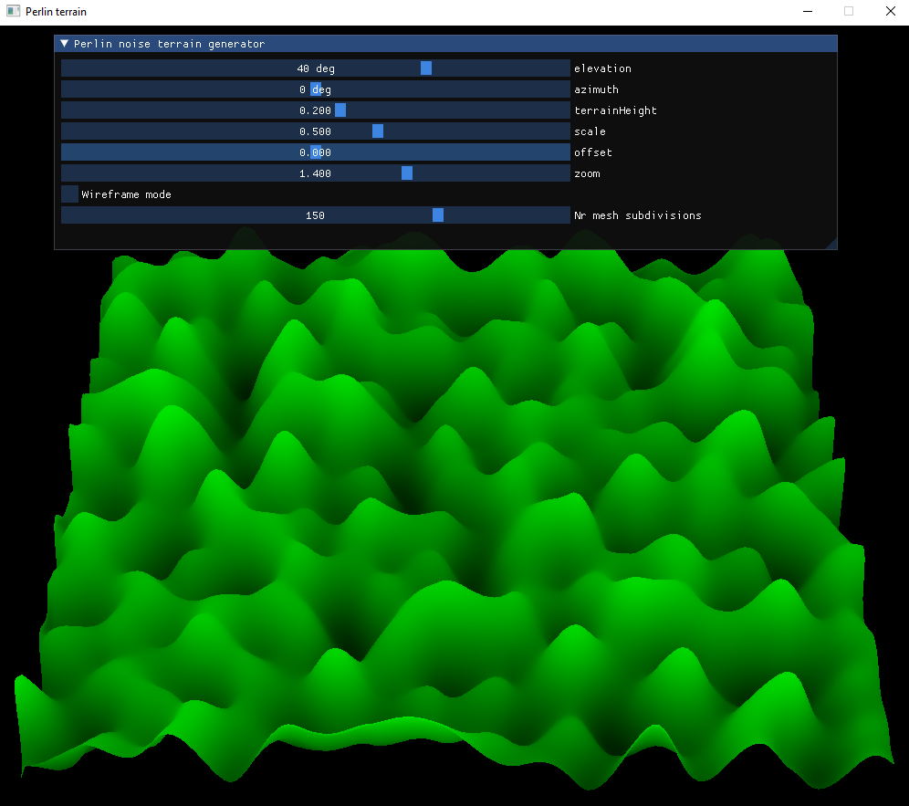

This project takes as input a perlin noise texture and uses it as a heightmap for some simple terrain.

```
./perlin-terrain <path to perlin noise texture>
perlin-terrain.exe <path to perlin noise texture> 
```



This repository in **in progress**, new features will be added. Feel free to post any problems or questions under the **Issues** tab. **Pull request** are also welcome.

The secondary goal of this repository is to provide you with a simple, documented OpenGL example. If you are interested in learning more about OpenGL, [learnopengl](https://learnopengl.com/) is a very thorough and well-made resource that is highly recommended.

### Dependencies

The project uses:

* OpenGL: to render triangles to the screen

* GLFW: to open a window

* GLAD

* GLEW

* ImGui: to add a GUI with useful widgets

GLFW and GLEW are submodules that need to be downloaded:

```
git clone https://github.com/jlartois/perlin-terrain.git
git submodule update --init --recursive
```

They can then be found in the `lib` folder, and will be build together with the rest of the project thanks to the CMakeLists.txt.

GLAD and ImGUI are already included as `.h` and `.cpp` files in the `include` directory.

### Building
use CMake. 

**Windows**: OpenGL comes by default on Windows.

**MacOS**: (untested but) OpenGL should come by default on MacOS.

**Linux**: (untested but) to setup OpenGL (if this was not already the case):
```
sudo apt-get install libglu1-mesa-dev
```
